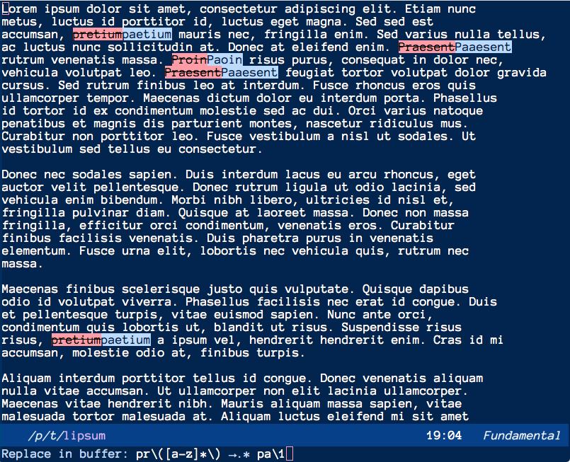

# visual-replace

[](https://github.com/szermatt/visual-replace/actions)
[](https://visual-replace.readthedocs.io/en/latest/?badge=latest)

Visual Replace provides a nicer interface to
[Query-Replace](https://www.gnu.org/software/emacs/manual/html_node/emacs/Query-Replace.html)
on Emacs than the built-in one.

The main improvements are:

 * The prompt of Visual Replace includes both the text to be
   replaced and the replacement. This makes it easier to craft
   possibly complex regular expression search and replace.

 * You can modify the scope and type of the search-and-replace
   command.

 * You can see what is going to be modified as you edit the command
   arguments.

Visual Replace is just an interface. The actual replacements are
always done by the standard Emacs commands.

The prompt also displays the mode of replacement:

* *text* → *replacement* executes `string-replace`
* *text* →? *replacement* executes `query-replace`
* *text* →.* *replacement* executes `replace-regexp`
* *text* →?.* *replacement* executes `query-replace-regexp`



More flags can be toggled, to control:

* the scope of the replacement, region or whole buffer
* whether search and replace applies on whole words only
* with or without `case-fold-search`
* with or without `replace-lex-whitespace`

If you leave `visual-replace` without confirming, with C-g, you can
continue where you left off next time by going up in the history,
with `C-p`.

While `visual-replace` is active, it scrolls the window to keep at
least one example of matches visible. You can also press up and down
to go through the matches. (`C-p` and `C-n` remain available to
navigate through history.)

> **The following is just a quick introduction. Read the full
> documentation at https://visual-replace.readthedocs.io/en/latest/**

## Comparison

What seems to be unique about `visual-replace` is the ability to edit
both the thing to be replacement and replacement at the same time. The
other packages I've found make it a 2-step process.

[visual-regexp](https://github.com/benma/visual-regexp.el) also
supports a preview, but uses its own search-and-replace mechanism and
only supports a regexp mode.

[anzu](https://github.com/emacsorphanage/anzu) also supports a preview
and supports a more powerful query-replace mechanism, and much more.
It was abandoned for a long time, but has been recently taken up by a
new maintainer.

## Installation

`visual-replace` requires Emacs 26.1.

To replace `query-replace' with `visual-replace' globally, do:

```elisp
(require 'visual-replace)
(visual-replace-global-mode 1)
```

With [use-package](https://github.com/jwiegley/use-package) and with a custom key binding:

```elisp
(use-package visual-replace
   :defer t
   :bind (("C-c r" . visual-replace)
          :map isearch-mode-map
          ("C-c r" . visual-replace-from-isearch)))
```

## Usage

Launch `visual-replace' with the keybinding you chose when installing, "M-%" by default.

In that mode:

* "TAB" navigates between the text to replace and the replacement string
* "RET" switches to the replacement string, the first time, then executes the replacement
* "M-% SPC" modifies the scope of the search (full buffer, from point, region)
* "M-% r" toggles regexp mode on and off
* "M-% q" toggles query mode one and off
* "M-% w" toggle limiting search to whole words
* "M-% c" toggle case-fold
* "M-% s" toggle lax whitespace

If you started `visual-replace` with another keybinding, replace M-X with that keybinding. Modify `visual-replace-mode-map` and `visual-replace-secondary-mode-map` to customize the keybindings.

`visual-replace-from-isearch` switches from an active isearch session
to `visual-replace`.

`visual-replace-thing-at-point` starts a visual replace session with
the symbol at point, or a specified thing as understood by
`thing-at-point`.

`visual-replace-selected` starts with the text within the current
active region.

## Testing

Install [eldev](https://github.com/emacs-eldev/eldev#installation) and
run tests with:

```sh
eldev test
```

## License

This project is licensed under the GPLv2 - see the [license](license) file for details
